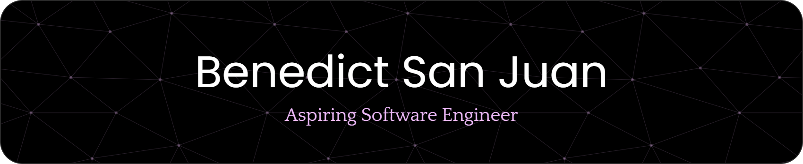

#

# 

About Me

  
 I’m a DLSL BS in Computer Science student currently working on portfolios, IoT systems, and various personal projects.  

<picture>
  <source media="(prefers-color-scheme: dark)" srcset="https://raw.githubusercontent.com/bmsj23/bmsj23/output/pacman-contribution-graph-dark.svg">
  <source media="(prefers-color-scheme: light)" srcset="https://raw.githubusercontent.com/bmsj23/bmsj23/output/pacman-contribution-graph.svg">
  
</picture>

#

# 

Socials

  
You can contact me on these social platforms  

  
  
  
  

#

# 

Tech Stack

  
Here are some of the technologies that I’ve tested, used, and currently utilize  

<h3>Programming Languages</h3>

  
  
  
  
  
  
  
  
  

 

<h3>Frontend Development</h3>

  
  
  
  
  
  
  
  
  

 

<h3>Backend Development</h3>

  
  
  
  
  

 

<h3>Tools & Platforms</h3>

  
  
  
  
  

#

# 

GitHub Stats

   
  

